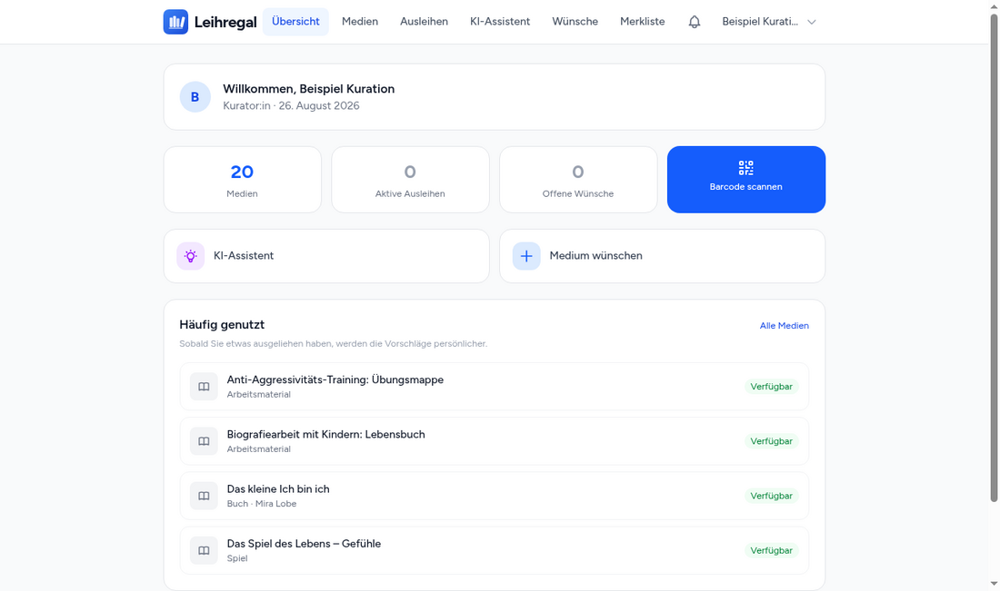
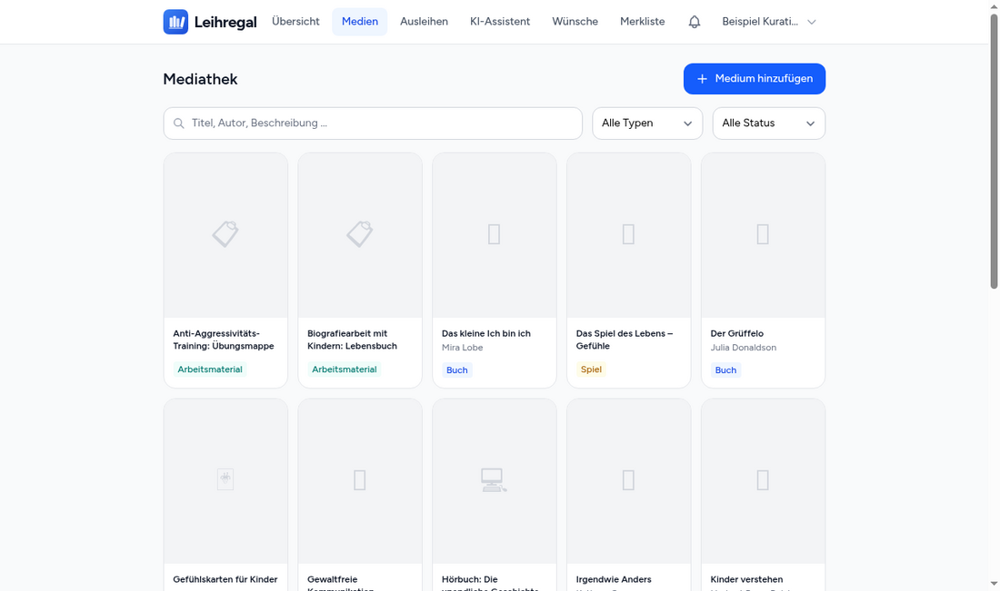
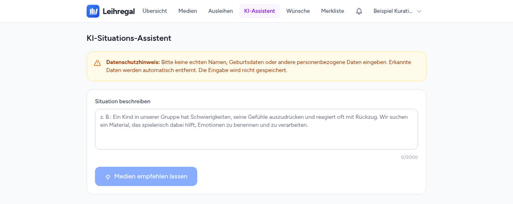
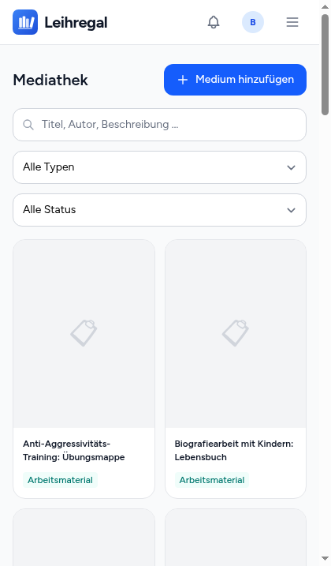

<div align="center">


# Leihregal

**Medienbibliothek mit Ausleihe, Reservierung und KI-gestützter Kuration –
für soziale und pädagogische Einrichtungen.**

[](LICENSE)
[](https://www.php.net/)
[](https://laravel.com/)
[](#tests)

</div>

<div align="center">



</div>

---

Viele Wohngruppen, Beratungsstellen und Schulsozialarbeitsteams besitzen einen
gewachsenen Bestand an Büchern, Gefühlskarten und Arbeitsmaterial. Wo er liegt,
weiß meist eine Person. Ob er noch aktuell ist, weiß niemand.

Klassische Bibliothekssoftware löst davon die Hälfte: Sie verwaltet, was da
ist. Die eigentliche Frage im Alltag ist aber eine andere – *„Ich habe morgen
ein Gespräch mit einem Zwölfjährigen, dessen Vater ausgezogen ist. Haben wir
dazu etwas?"* Leihregal beantwortet auch diese Frage, weil Empfehlung,
Kuration und Bestandsanalyse Teil des Kerns sind und nicht ein Zusatz.

> **Die KI ist optional.** Ohne API-Schlüssel läuft die Bibliothek
> vollständig – Erfassung, Ausleihe, Reservierung, Wünsche, Berichte. Es
> entfallen nur die Funktionen, die ein Sprachmodell brauchen.

---

## Was es kann

### Bestand

- **Erfassung per ISBN-Scan** mit der Handykamera. Titeldaten und Cover kommen
  automatisch aus Google Books.
- **Ohne ISBN**: Foto hochladen, Felder ausfüllen – für Kartensets, Kopiervorlagen
  und alles, was keinen Barcode trägt.
- **Sechs Medienarten**: Buch, Gefühlskarten, Spiel, Zeitschrift,
  Arbeitsmaterial, digitale Ressource.
- **Eigene Etiketten** als QR-Code, einzeln oder als Bogen mit 30 Stück auf A4.
- **Standorte und Exemplare** – mehrere Kopien desselben Titels, jede mit
  eigenem Code.

### Ausleihe

- Ausleihen und Zurückgeben per **Barcode-Scan**, zwei Fingertipps.
- **Reservierung mit Warteliste**, die der Reihe nach abgearbeitet wird.
  Wird ein Medium frei, geht die Nachricht automatisch raus.
- **Fristerinnerungen** 3 Tage vorher, 1 Tag vorher, am Fälligkeitstag und
  danach – per E-Mail, im Benachrichtigungs-Center und optional als Web-Push
  auf den Sperrbildschirm.
- **Verlängerung**, **Schadensmeldung**, **Merkliste**, kurze Bewertung bei
  der Rückgabe.

<div align="center">

</div>

### Wenn ein Sprachmodell angebunden ist

- **Situations-Assistent**: Eine Situation beschreiben, passende Medien aus dem
  *eigenen* Bestand bekommen – mit Begründung, und mit einem ehrlichen „nichts
  Passendes vorhanden", wenn es so ist.
- **Ähnliche Medien** über Vektorsuche statt Stichwortsuche.
- **Persönliche Empfehlungen** auf dem Dashboard, abgeleitet aus dem, was
  jemand bisher ausgeliehen hat.
- **Einsatz-Assistent**: konkrete Vorschläge, wie sich ein bestimmtes Medium in
  einer bestimmten Situation einsetzen lässt.
- **Bestandslücken-Analyse**: Welche Themen und Altersgruppen fehlen? Ergebnis
  sind kaufbare Titel – **ausschließlich aus einer selbst gepflegten Whitelist
  von Verlagen und Autor:innen**.
- **Veraltungs-Check**: Welche Titel sind fachlich überholt?
- **Wunsch-Bündelung**: Ähnliche Anschaffungswünsche werden automatisch
  zusammengefasst, damit aus fünf Einzelmeldungen ein Argument wird.

<div align="center">

</div>

### Verwaltung

- **Drei Rollen** – Betreuung, Kuration, Administration – mit klar getrennten
  Rechten. **Keine Selbstregistrierung**: Konten legt die Administration an.
- **Anschaffungsliste** als PDF und CSV, **Bestandsliste** als PDF.
- **Quartalsbericht** mit Kennzahlen, automatisch am Quartalsanfang.
- **Änderungsprotokoll** für alle Kurations- und Verwaltungsvorgänge.

---

## Datenschutz

Die Anwendung ist für ein Feld gebaut, in dem es um Kinder, Jugendliche und
Familien in schwierigen Lagen geht. Entsprechend ist sie gebaut:

| | |
|---|---|
| **PII-Filter vor jedem KI-Aufruf** | Telefonnummern, E-Mail-Adressen, Geburtsdaten, Altersangaben und Namen werden im Situations-Chat erkannt und durch Platzhalter ersetzt, **bevor** der Text den Server verlässt |
| **Kein Chatverlauf in der Datenbank** | Die Eingabe wird nicht gespeichert |
| **Schriften lokal** | Figtree liegt im Projekt, nicht bei einem CDN. Keine IP-Adresse der Nutzenden geht an Dritte |
| **Selbst gehostet** | Ein Server, eine Datenbank. Kein Dienst dazwischen |
| **Geschwärzte Protokolle** | Felder mit `password`, `token`, `secret` oder `api_key` im Namen erscheinen im Änderungsprotokoll nur als Platzhalter |

Der PII-Filter arbeitet regelbasiert und ist damit nicht unfehlbar. Die
Oberfläche sagt das an der betreffenden Stelle auch deutlich.

---

## Für unterwegs gebaut

Die Anwendung wird überwiegend am Handy bedient – im Auto vor dem Hausbesuch,
im Gruppenraum, im Regal stehend. Sie ist deshalb mobile-first entwickelt und
lässt sich über „Zum Startbildschirm hinzufügen" wie eine App ablegen.

<div align="center">

</div>

---

## Whitelabel

Die Anwendung trägt keinen Namen im Code. Wer sie unter eigenem Namen betreibt,
ändert die `.env`:

```dotenv
APP_NAME="Bücherei Musterstadt"
BRAND_UNTERTITEL="Medienausleihe"
BRAND_FARBE="#0F766E"
```

Das wirkt sofort auf Logo, Browser-Tab, E-Mails, PDF-Berichte, das
Web-App-Manifest und den Home-Bildschirm.

Auch der **fachliche Zuschnitt** ist konfigurierbar. Diese Werte gehen wörtlich
in die Prompts an das Sprachmodell ein – wer die Bibliothek in einem anderen
Feld betreibt, bekommt dadurch passendere Empfehlungen:

```dotenv
BRAND_EINRICHTUNG="Grundschule mit Ganztagsbetreuung"
BRAND_FACHKRAEFTE="Lehrkräfte und pädagogische Fachkräfte"
BRAND_ZIELGRUPPE="Kolleg:innen"
```

Erläuterungen zu jedem Wert stehen in [`config/branding.php`](config/branding.php),
das vollständige Vorgehen samt eigenem Logo in [`docs/marke.md`](docs/marke.md).

---

## Installation

**Voraussetzungen:** PHP 8.3+, Composer, Node.js 20+, MariaDB 11.7+ oder MySQL 8,
ein Webserver.

> MariaDB ab 11.7 wird empfohlen: Der Spaltentyp `VECTOR` beschleunigt die
> Ähnlichkeitssuche erheblich. Ohne ihn läuft alles weiter, die Suche fällt
> dann auf einen Vergleich in PHP zurück.

```bash
git clone https://github.com/benhartwich/leihregal.git
cd leihregal

composer install
npm ci && npm run build

cp .env.example .env
php artisan key:generate
```

Danach in der `.env` mindestens `APP_URL` und die Datenbankzugänge eintragen.
Dann:

```bash
php artisan migrate
php artisan db:seed          # Administrationskonto + Verlags-Whitelist
```

Der Seeder gibt ein zufällig erzeugtes Passwort aus. Es erscheint **einmal** –
notieren und nach dem ersten Login unter „Mein Profil" ändern.

**Zum Ausprobieren** gibt es einen Beispielbestand: vier Standorte, drei
Konten für die drei Rollen und zwanzig Medien quer durch alle Medienarten.

```bash
php artisan db:seed --class=BeispieldatenSeeder
```

Zuletzt braucht der Server einen Minutentakt für die geplanten Aufgaben –
Fristerinnerungen, Quartalsbericht, Wunsch-Bündelung:

```cron
* * * * * cd /pfad/zum/projekt && php artisan schedule:run >> /dev/null 2>&1
```

Ausführlich: [`docs/administration.md`](docs/administration.md).
Für spätere Aktualisierungen liegt ein Deploy-Skript bei (`./deploy.sh`), das
zuerst die Tests laufen lässt und ohne grüne Suite nichts verändert.

### KI-Funktionen anschalten (optional)

```dotenv
ANTHROPIC_API_KEY=      # Assistent, Medienanalyse, Kuration
OPENAI_API_KEY=         # Embeddings für Ähnlichkeit und Empfehlungen
GOOGLE_BOOKS_API_KEY=   # optional, erhöht nur das Anfragelimit beim ISBN-Import
```

Bereits erfasste Medien bekommen ihre Embeddings nachträglich:

```bash
php artisan media:backfill-embeddings
```

---

## Technik

| Ebene | Verwendet |
|---|---|
| Backend | PHP 8.3, Laravel 13 |
| Frontend | Livewire 4 + Volt, Alpine.js, Tailwind CSS 4, Vite 8 |
| Datenbank | MariaDB mit `VECTOR`- und `FULLTEXT`-Index |
| Sprachmodell | Anthropic Claude (Analyse, Beratung, Kuration) |
| Embeddings | OpenAI `text-embedding-3-small`, 1536 Dimensionen |
| Auth | Laravel Breeze, Livewire-Stack |
| Scannen | `@zxing/browser` im Browser, kein nativer Anteil |
| Ausgabe | dompdf für Berichte, `picqer` und `chillerlan` für Codes |

Beides – Modell und Embedding-Modell – ist über `config/services.php`
austauschbar.

### Tests

```bash
php artisan test          # 172 Feature- und Unit-Tests
php artisan dusk          # 11 Browsertests, braucht ./dusk-server.sh
```

Die Testsuite trägt einen **Schutzwall gegen Datenverlust**: Vor jedem Lauf
wird geprüft, dass die konfigurierte Datenbank nicht die aus der `.env` ist
und ihr Name der Konvention `_test` folgt. `RefreshDatabase` leert die
Datenbank, gegen die es läuft – ohne diese Prüfung genügt eine vergessene
Zeile in `phpunit.xml`, um den Produktivbestand zu verlieren. Der Wall liegt
doppelt vor, weil Dusk nicht von `Tests\TestCase` erbt.

---

## Dokumentation

| Datei | Inhalt |
|---|---|
| [`docs/administration.md`](docs/administration.md) | Betrieb: Nutzerverwaltung, Deployment, Scheduler, Fehlersuche |
| [`docs/handbuch.md`](docs/handbuch.md) | Kurzanleitung für Mitarbeitende – zum Anpassen und Weitergeben |
| [`docs/backup.md`](docs/backup.md) | Datensicherung samt fertiger systemd-Einheiten in `ops/backup/` |
| [`docs/marke.md`](docs/marke.md) | Erscheinungsbild, eigener Name, eigenes Logo |

---

## Mitmachen

Fehlerberichte, Verbesserungen und Erfahrungsberichte aus dem Praxiseinsatz
sind willkommen – siehe [CONTRIBUTING.md](CONTRIBUTING.md). Ein
Sicherheitsproblem gehört nicht in ein öffentliches Issue, dafür gibt es
[SECURITY.md](SECURITY.md).

Die Oberfläche, die Dokumentation und ein Großteil der Bezeichner im Code sind
auf Deutsch. Das ist Absicht: Die Anwendung wird von Menschen bedient, die
keine Software entwickeln, und die Sprache soll zwischen Oberfläche, Handbuch
und Code nicht wechseln.

---

## Lizenz

[MIT](LICENSE). Nutzung, Änderung und Weitergabe sind frei – auch gewerblich.

Mitgeliefert wird zusätzlich die Schrift **Figtree** unter der SIL Open Font
License 1.1, siehe [NOTICE.md](NOTICE.md).
